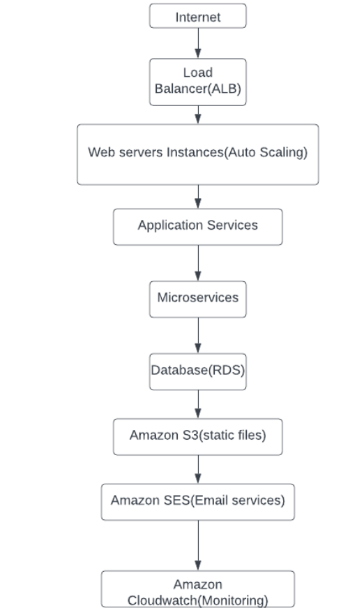

### Architecture diagram for a B2C Flight Booking Portal that can handle peak traffic and provide analytics reports:

### Explanation of components:
**1.Internet:** Represents the external network from where users access the flight booking portal.

**2.Load Balancer (ALB):** Distributes incoming traffic across multiple web server instances to ensure scalability, high availability, and fault tolerance.

**3.Web Servers(with autoscaling):** Web servers handle the presentation layer of the portal and interact with the users. Multiple instances running web server software to serve incoming user requests. These instances can automatically scale up or down based on traffic load.

**4.Application Servers:** Backend servers responsible for handling business logic, flight booking processing, and interacting with the database.

**5.Microservices:** It represent the modular and decoupled components that handle specific tasks within the flight booking portal. They can include services for flight availability, pricing, user management, notifications, and more. Microservices can be developed, deployed, and scaled independently.

**6.Database (RDS):** Stores flight and customer data, providing the necessary persistence for the booking portal. RDS ensures data durability, backups, and scalability.
* The database, such as Amazon RDS, stores flight data, customer information, and other relevant data.
* It provides persistence, data consistency, and scalability to handle the demands of the flight booking portal.
* The database can be configured for automated backups, replication for high availability, and scalability to handle increased traffic.

**7.Amazon S3:** Stores static files such as images, stylesheets, and JavaScript files associated with the flight booking portal. It enables efficient content delivery and reduces the load on web servers.

**8.Amazon SES:** Provides email services for sending notifications and confirmations to customers during the booking process.

**9.Amazon CloudWatch:** It is used for monitoring and logging purpose. Monitors the health and performance of the system, captures logs, and enables proactive alerts and notifications for system administrators.

### Additional considerations:

**1.Elasticity:** The architecture should be designed to handle peak traffic load by automatically scaling up or down the number of web server instances and application servers based on demand.

**2.Analytics Reports:** To generate analytics reports, you can incorporate tools such as AWS Glue or Amazon Redshift to extract, transform, and load data from the database and perform analytics on various fields.

**3.Flight Booking Portal:** The architecture supports a web-based portal where customers can access the flight booking system, search for flights, select dates, and complete the booking process.

**4.Security:** Implement appropriate security measures such as SSL/TLS encryption, network security groups, and user authentication to ensure data privacy and protect against unauthorized access.

**6.High Availability:** The architecture should be designed for high availability to minimize downtime and ensure that the flight booking portal remains accessible to users at all times.

**7.Payment Gateway Integration:** Integrate with payment gateways to facilitate secure online payments for flight bookings.

**8.External Services:** The architecture may include integration with external services such as airline APIs for real-time flight information and availability.

**9.User Authentication and Management:** Implement user authentication and authorization mechanisms to secure user accounts and manage user profiles.

**10.Caching:** Utilize caching mechanisms, such as Amazon ElastiCache, to improve performance and reduce load on the application servers.

**11.Amazon Glue:** AWS Glue can be used to extract, transform, and load data from the database to perform analytics and generate reports on various fields, helping understand booking trends, customer preferences, and other insights.

### Decoupling in this architecture is achieved through the separation of concerns and responsibilities among different components:
**1.Microservices Architecture:** Decompose the system into smaller, loosely coupled microservices, where each microservice handles a specific business capability (e.g., flight search, booking, user management). This allows for independent development, scalability, and fault isolation.

**2.Message Queuing:** Utilize message queues like Amazon Simple Queue Service (SQS) to decouple components and enable asynchronous communication between them. For example, when a booking request is made, it can be placed in a queue for later processing by the booking service.

**3.Application Services** provide a layer of abstraction between the web servers and the microservices, allowing flexibility and agility in integrating and evolving the system.

**4.Data Services** handle data storage and management independently, allowing for scalability, data integrity, and decoupling from the application services.

### Explanation of Business Scopes and Conditions:

* **Business Scopes:** The B2C Flight Booking Portal aims to provide a user-friendly platform for customers to book flights. The business scope includes the following key aspects:
  * **Flight Search and Booking:** Customers should be able to search for flights based on various criteria such as origin, destination, date, and passenger count. They should be able to view available flights, select their preferred options, and complete the booking process.
  * **User Management:** The portal should provide user registration, login, and profile management functionalities. This allows customers to have personalized experiences, view booking history, and manage their preferences
  * **Payment Integration:** The portal should integrate with payment gateways to facilitate secure and seamless online payments for flight bookings. This ensures a smooth and convenient payment process for customers.  

* **Conditions:** The B2C Flight Booking Portal operates under certain conditions and requirements:
  
  * **Peak Traffic Load:** The portal should be capable of handling high volumes of traffic, especially during peak hours or special events. It should scale horizontally to accommodate the increased demand and ensure smooth user experiences without any performance degradation.

  * **Analytics Reports:** The system should generate analytics reports on various fields such as booking trends, popular destinations, revenue, and customer demographics. These reports provide valuable insights to optimize business strategies, improve customer experiences, and make data-driven decisions.

